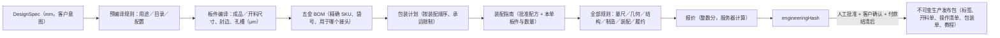

# Custom Flat-Pack Furniture Platform

AI、参数化设计与数字制造驱动的定制板式家具项目。

当前阶段：方向验证与 Pre-PRD 的结论为 **Conditional Go**——先用一个城市、一个生产流程、两种柜体模板和一套材料／五金体系完成小规模付费验证。本仓库在文档之外，实现了 [PRD v0.1](docs/02-prd-v0.1.md) 中 V1 的 P0 软件范围：一个受约束的消费端配置器、确定性的工程内核，以及从人工复核、报价、确认、放行到质检齐套、售后和成本记录的运营后台。

> 与文档一致的边界：代码里的板材、五金、连接件、荷载、价目、服务邮编全部是 **开发占位数据**（目录中标记为 `provisional`）。规则引擎会在每一单上标记 `CAT-002`，在供应商 SKU、批次、公差和实物验证登记之前，任何订单都不能被视为可直接投产的工程发布。

## 文档

- [项目原始上下文](docs/00-project-context.md)
- [可行性分析](docs/01-feasibility-analysis.md)
- [PRD v0.1](docs/02-prd-v0.1.md)

## 快速开始

要求：Node.js ≥ 20.9（开发时使用 24.x），npm ≥ 10。不需要 Docker 或本地 PostgreSQL——开发环境默认使用内嵌的 PGlite（WASM 版 PostgreSQL），数据落在 `apps/web/.data/pglite`。

```bash
npm install
npm run dev          # http://localhost:3000
```

- 消费端入口：`/`，从「Start a design」进入 FR-01 门槛问卷，再到配置器。
- 后台：`/admin`，开发默认密码 `admin`（通过 `.env` 里的 `ADMIN_PASSWORD` / `AUTH_SECRET` 修改，见 `apps/web/.env.example`）。
- 后台首页有「Create demo orders」按钮（仅非生产环境），会用真实业务流程生成 4 个处于不同阶段的订单：草稿、待复核、已报价、生产中。
- 演示服务区邮编为 3000–3207（`apps/web/src/db/seed-data.ts`），上线前必须替换为运营已核价的邮编。

其他脚本：

```bash
npm run typecheck    # 两个 workspace 的 tsc
npm test             # 内核 90 个测试 + Web 端 24 个生命周期集成测试
npm run build        # Next.js 生产构建
```

连接真实 PostgreSQL：在 `apps/web/.env` 设置 `DATABASE_URL`，迁移在应用启动时自动执行（`apps/web/src/db/migrations.ts`，幂等 SQL，按顺序追加）。

## 代码结构

```
packages/core   @cfp/core   确定性工程内核（纯 TypeScript，可在 Node 与浏览器运行，无数据库、无机床、无模型调用）
apps/web        @cfp/web    Next.js 16（App Router）+ Drizzle ORM + PGlite/PostgreSQL + three.js
docs/                       需求与分析文档
```

### `@cfp/core`：内核管线



| 模块 | 内容 |
| --- | --- |
| `units`, `ids` | µm/mm 换算、单位确认、量级合理性检查；规范化 JSON 与纯 JS SHA-256 内容哈希 |
| `catalog` | 版本化目录：模板 O（开放格）与 D（柜门）、材料、封边、背板、五金体系、构造规则、工厂能力、价目表、用途表、工程验证包（`catalogue_sellable`） |
| `design`, `measurement` | Zod 校验的 DesignSpec 与 MeasurementSet（测量来源：约数／复测／专业／照片估计／扫描估计） |
| `panels` | 确定性板件编译器：侧板、底板、顶板（整块或分段）、背板、层板、门；连接件口袋与导向孔、铰链杯与底座孔、层板销 32 mm 系统孔、拉手孔、柜脚定位孔、模块间连接孔 |
| `rules` | 35 条带编号规则，返回 `PASS` / `REVIEW_REQUIRED` / `UNSUPPORTED` 及字段与建议；配置失败时不编译并标记 `compiled=false` |
| `pricing` | 逐项报价：板材（含排版损耗）、封边、CNC、五金、质检包装人工、包材、间接费、工程审核、配送、售后准备金、平台服务、GST |
| `assembly`, `packaging` | 步骤依赖图校验、每步所需板件与五金、包件重量／尺寸与承运限制 |
| `orders` | 订单／支付／工程三条独立状态机，放行门槛 `evaluateReleaseGate`，报价有效性 |
| `release` | `buildProductionRelease`：按订单＋版本＋哈希＋序号生成确定性 `releaseKey`，附标签、文件清单、开料单 CSV、操作清单 CSV。`buildReplacementRelease`：从旧发布包逐字复制一块板或一袋五金，生成独立补件版本 |
| `ai` | 自然语言修改提议（确定性解析器，中英文）：只产生允许字段内的参数变更，歧义时追问，越界时拒绝并给替代方案；`ProposalProvider` 接口可替换为 LLM 实现 |

### `@cfp/web`：页面与流程

消费端（英文界面，面向澳洲市场）：

| 路由 | 对应 PRD |
| --- | --- |
| `/start` | FR-01 用途／邮编／配送方式门槛；不支持时保留询价（`enquiries`） |
| `/templates`, `/templates/[id]` | 模板详情、验证包状态、材料五金、示例图 |
| `/design/[orderId]` | FR-03 配置器：three.js 三维预览（旋转、正视／侧视／俯视、开门、尺寸）、SVG 二维尺寸图、实时规则与估价（服务器计算）、撤销、版本保存；FR-04 自然语言修改（先看差异与价差再应用） |
| `/design/[orderId]/measure` | FR-02 量尺向导：成品尺寸与可用空间分开、三处宽度、单位换算确认、来源、踢脚线／障碍、内部需求、搬入通道、照片证据（不升级为生产尺寸） |
| `/orders/[orderId]` | 订单状态、报价、付款（试点为手工记录、幂等）、生产进度与包件、售后 |
| `/orders/[orderId]/confirm` | FR-07 二维图、可见结构、材料与荷载说明、正式报价、逐项确认与签名；保存快照与哈希 |
| `/orders/[orderId]/assembly` | FR-11 本单装配指南（可打印、按板件/五金袋反查） |
| `/guide/[releaseKey]` | 标签二维码入口：只显示装配指南，不含客户与付款信息 |
| `/orders/[orderId]/support` | FR-12 按板件／五金袋编号开售后单，可上传照片 |

后台（`/admin`）：

| 区块 | 对应 PRD |
| --- | --- |
| 工程 | FR-05 完整规则报告、量尺记录、版本历史；审核决定（批准／需修改／阻断）；规则判定 `UNSUPPORTED` 时不可批准 |
| 报价 | FR-06 服务器重算价格，工程哈希漂移则拒绝；有效期上限 7 天；旧报价自动作废；可把报价估算复制到成本台账 |
| 收款 | FR-07 收款台账，以银行／网关参考号作幂等键；确认前可收可退意向金（不启动生产） |
| 放行 | FR-08 门槛逐条列出；发布包不可覆盖；开料单／操作清单 CSV、Release JSON、带 QR 的标签、包装单 |
| 目录 | 模板、验证包、材料、五金、工厂能力、价目、规则清单；服务邮编可增删 |
| 车间 | FR-09/10 开始生产、质检（逐板通过／不通过）、包装（称重＋核对）、出库校验（全部板件检验通过、全部包件核对、款项结清、无阻断）、送达、完成、阻断开关、停止发布 |
| 售后 | FR-12 案件状态（已回复／已解决分别记录）、原因分类、责任、成本；从原发布包生成单板／五金袋补件任务（不重编译当前模板）、补件质检包装与发运 |
| 成本 | FR-13 实际成本记录与毛利／CM1／CM2 计算；未记录的类别明确标出，不默认为零 |

访问控制（试点级）：员工使用共享密码与签名 cookie；客户由匿名 cookie 识别，也可通过订单的不可猜测访问链接（`?t=`）打开并「认领」订单。

## 关键约束在代码中的落点

- **版本与哈希**：每次保存都是新的 `design_versions` 行，带完整工程结果与 `engineeringHash`。报价、确认、发布包都绑定具体版本与哈希；任何改动都会让放行门槛报「版本不一致」。
- **PASS 仍需人工批准**：自动规则 `PASS` 只把工程状态置为 `review_required`；只有员工批准才是 `approved`。
- **付款不等于批准**：订单／支付／工程三个状态独立，放行同时检查三者。
- **幂等**：付款以幂等键唯一；发布包以 `releaseKey` 唯一，重复请求不会生成第二个可执行任务。
- **AI 不落地**：自然语言只产生提议；应用后走与表单完全相同的规则与报价。没有 AI 也能完成购买。
- 视觉估计不升级：照片／扫描来源的尺寸永远不会被当作已验证尺寸。照片文件保存在本机上传目录，只作为证据引用。

## 测试

- `packages/core/test`：12 个可复算的批准样例（最小／最大组合、1／2／3 模块、门向、开放格、最大跨度、整块／分段顶板、受限空间、自提）；每条阻断规则的触发样例与边界合法样例；确定性与哈希；状态机、支付状态、放行门槛、报价有效性；发布包与 CSV；从旧发布包生成补件（不采用后续编译结果）；单位换算；自然语言提议；SHA-256 与 Node 实现比对。
- `apps/web/test`：在内存 PGlite 上跑完整生命周期——门槛拒绝与放行、版本追加、量尺、提交、员工登录、审核、报价、确认快照、幂等付款、放行门槛与发布包、质检与包装阻断、出库、售后、从原发布包生成补件、照片上传、安全案件阻断新生产、成本贡献；以及变更控制（报价后修改作废报价、`UNSUPPORTED` 不可批准）、访问链接认领、演示数据。

## 本阶段未实现（有意留白）

- 真实支付网关与邮件／短信通知（试点为手工记账）。
- LLM 提议提供方（已定义 `ProposalProvider` 接口，默认确定性解析器）。
- 工厂适配器（只提供板件与操作语义的 CSV 导出，排版、刀具、后处理按 PRD 在目标工厂生成）。
- 多工厂、全国配送、服务区后台维护、正式的用户账户体系。

## 重要边界

这些文档与代码不是可直接投入生产的工程图或安全认证。板材、五金、连接、荷载、稳定性、制造公差、包装和固定方案必须根据实际设备、供应链、适用要求和实物验证后发布；目录中的占位数据需要替换为登记的供应商数据并完成模板验证包后，`catalogue_sellable` 才有意义。
