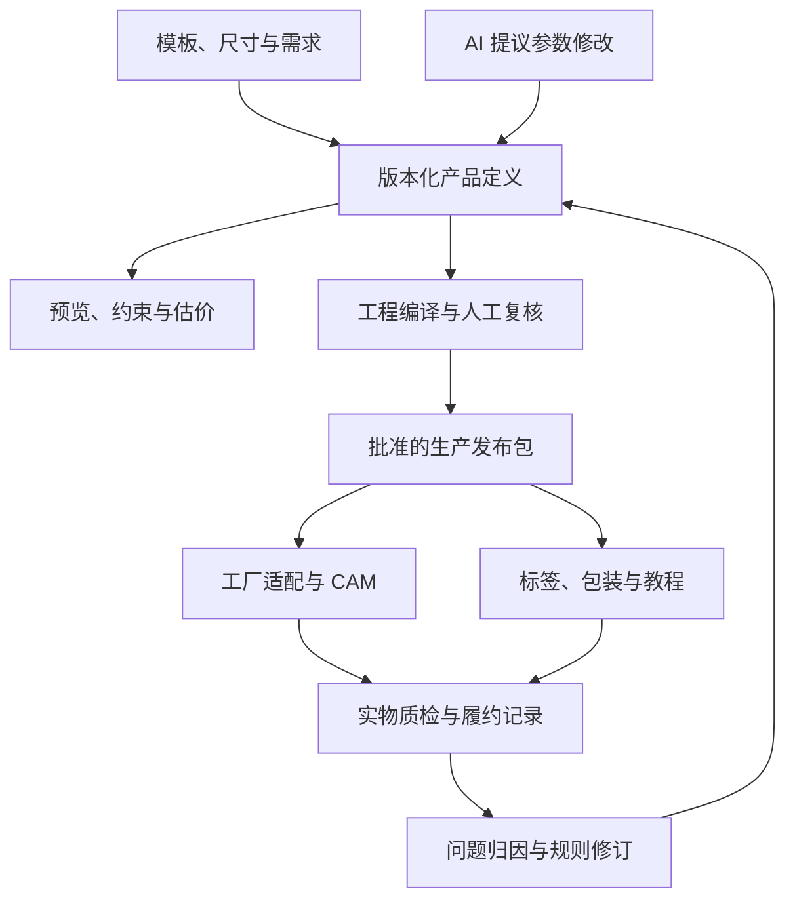

# 定制板式家具平台：可行性分析与创业决策

分析日期：2026-09-07  
依据：上传的《AI 定制板式家具平台｜项目上下文与二次分析 Brief》全文，以及截至分析日期可查的企业、软件厂商和澳洲官方资料。  
配套文件：《定制板式家具平台_PRD_v0.1.md》。

> **结论：Conditional Go——支持小规模、受控的付费验证。当前证据不足以支持直接开发全品类平台、购买整条产线或组建全国制造网络。**
>
> 推荐产品定义：帮助成品家具尺寸不合适的家庭，选择经过验证的柜体结构，定制有限的尺寸与收纳配置，收到已加工、编号、齐套的板件和五金，并按订单专属教程完成组装。

本文将“外部已核实事实”“分析判断”“需要试验的假设”区分开。没有拿到你的设备清单、实际工价、历史订单、客户访谈或工厂报价；文中的成本、周期和业务门槛均为规划模型，不能视为已证明的收益或工程认证。

## 1. 先回答：什么成立，什么还没有成立

| 命题 | 判断 | 对项目的意义 |
| --- | --- | --- |
| 参数化柜体可以拆单、生成加工数据、做成套件 | 技术路径成立，已有成熟工具 | 不必从零发明 CAD/CAM |
| 消费者会购买网上配置的定制平板家具 | 有商业供给证据 | 产品类别存在，但你的需求规模与盈利仍需验证 |
| 自然语言可以降低选型和修改门槛 | 合理假设 | 应与模板、尺寸图搭配，不能代替量尺和工程规则 |
| 普通消费者能稳定装好你的产品 | 未验证 | 连接方式、包装顺序、说明书必须一起设计 |
| 澳洲适合起步 | 对已有本地履约资源的团队，有条件成立 | 首发范围应由工厂与配送半径决定 |
| AI、3D、自动开料构成明显壁垒 | 单独不成立 | 已有直接竞品，技术可购买或复制 |
| 先做所有柜类，再逐步平台化 | 不建议 | 测量、五金、结构、安装与物流复杂度会同时扩张 |
| 一开始就做开放制造 marketplace | 当前 No-Go | 未证明订单密度、供应一致性和平台可留利润 |

**这个项目首先是一门需要承担交付责任的定制家具生意，其次才是软件平台。** 软件的价值，要落到每单减少多少审核、错误、装配求助和补件上。

## 2. 原 MD 最需要修正的 10 个地方

| 原文位置／假设 | 建议修正 |
| --- | --- |
| 第 10、17 节：去掉房车后范围更干净，V1 做“柜类” | 去掉车身曲面和行驶要求确实减少工程范围，但同时失去原来的客户与场景边界。“柜类”仍然过宽，应只做一个明确用途和结构族 |
| 第 11、12 节：描述需求即可形成完整订单 | 需求理解和工程输入分开。预算、风格可模糊；生产尺寸、用途、安装条件不可由 AI 猜测 |
| 第 13 节：电视柜、衣柜、洗衣柜等共用参数系统 | 可共用板件基础设施，不能共用未经区分的承重、连接、固定、环境和安装规则 |
| 第 3 节：“CAD 是生产真相” | 更准确的是“批准的产品定义、规则版本和生产发布包共同构成订单依据”。独立的 CAD 文件无法覆盖五金、包装、教程、变更与质量追溯 |
| 第 5、14 节：仿真检查可制造性、吸附和结构 | 几何检查可以识别部分问题；吸附、板件移动、崩边、连接可靠性仍需现场工艺试验与实物验证 |
| 第 15、27 节：空间理解作为固定 V1.5 | 取消固定排期。只有测量失败是主要损失来源、且视觉试验确实改善结果时才投入 |
| 第 16、25 节：从模型自动生成安装教程 | 几何本身没有完整的安装知识。还需要连接关系、方向、装配顺序、工具可达性、临时支撑和安全步骤 |
| 第 19、24 节：生产包包含统一 Nesting 与机器指令 | 跨工厂统一板件与工艺语义；排版、装夹、刀具、后处理和机床指令应在目标工厂适配层生成 |
| 第 26 节：“最终一定能制造” | 对外承诺应建立在批准配置与可用产能上。系统应能明确拒绝或转人工；不能把确定性计算等同于零缺陷 |
| 第 27 节：先工厂验证，再 C 端 MVP | 商业需求应与最小工程试验同时验证。不要先花数月把自动拆单做完，再发现客户不愿意付费 |

保留原文最有价值的三点：**受约束的定制、AI 与制造执行分离、用真实履约数据完善规则。**

## 3. 市场不是空白：最接近的竞争者

下表仅说明官方公开能力，不把企业宣传、展示订单或营业额案例当作独立验证的盈利证据。

| 企业／产品 | 已公开提供的能力 | 对你的项目意味着什么 |
| --- | --- | --- |
| goFlatpacks，澳洲 | 用户在线规划、按尺寸订购，板件由本地制造商加工，并提供组装视频 | 与原文从需求到自装套件的方向高度重合。[官网](https://goflatpacks.com.au/)、[组装支持](https://goflatpacks.com.au/build/how-to-assemble-videos/) |
| goCabinets，澳洲／新西兰 | 在线选柜、输入尺寸、即时价格，连接本地制造商；官网称合作网络覆盖澳洲各州与新西兰 | “平台＋本地制造网络”已有直接实践，不能把联网工厂本身当成创新。[官方流程与网络](https://gocabinets.com.au/) |
| Custom Cabinets Direct，澳洲 | 在线定制柜与即时价格，面向木工、建筑商，也接受 DIY 业主 | C 与 Trade 混合入口已存在；需要证明具体体验或履约优势。[官方说明](https://www.customcabinetsdirect.com.au/) |
| kaboodle，澳洲 | 3D 规划器；部分产品可定制宽度 | 标准品牌也在覆盖部分非标需求，并非只能二选一：标准家具或传统木工。[定制说明](https://kaboodle.com.au/design-blog/why-buy-a-flatpack-kitchen)、[3D 规划器](https://kaboodle.com.au/3d-kaboodle-planner-support) |
| Tylko，欧洲参考 | 尺寸配置、SimpleClick 连接、按装配顺序包装、订单专属说明书及部分地区装配服务 | 安装体验是产品工程能力，不是加一个 3D 页面就形成的差异。[产品与装配说明](https://tylko.com/en-ot/product-lines/tv-stand) |
| Pickawood，欧洲参考 | 在线配置的定制书柜、边柜、衣柜等 | 证明受约束定制家具的产品形态；不能直接推断其澳洲履约或你的本地需求。[欧洲官网](https://www.pickawood.com/eu) |
| IKEA BESTÅ，澳洲 | 成熟的标准化组合产品与明确零售价 | 定制必须解决足够重要的问题，才能承受价格差。[澳洲产品目录](https://www.ikea.com/au/en/cat/besta-tv-benches-12153/) |

一个现实价格锚点：检索时 IKEA 澳洲目录展示 180×42×38 cm 的某款 BESTÅ 带门电视柜为 A$325。它与本项目的材料、服务和规格不等同，价格也会变动，但它说明：消费者如果只是想要“白色、好看、有储物空间”，便宜得多的替代品已经存在。[IKEA 澳洲目录](https://www.ikea.com/au/en/cat/besta-tv-benches-12153/)

**市场机会要从“现有方案在什么订单上失败”寻找。** 建议对同一个真实需求，比较你的方案、上述在线定制网站和一个本地木工方案，记录最终总价、完成选型耗时、尺寸确认难度、安装条件、交期与补件责任。不能只拿 IKEA 做对照，也不能未经测试声称竞品难用。

## 4. 最合理的切入口

### 4.1 推荐的第一类用户

首发假设：工厂所在城市及可控配送范围内，已经找过成品家具但尺寸或储物分隔不合适的业主；有一次以上平板家具组装经验，能接受有限选项和必要的墙体固定安排。

首次沟通应能识别三个事实：

1. 他具体买不到什么尺寸／分隔，而不是泛泛“想要定制”。
2. 他在比较哪一个成品、定制网站或木工报价。
3. 他接受的总价是否包含配送、可能的固定／安装，以及等待时间。

若大部分访谈对象的唯一诉求是“比 IKEA 更便宜”，应停止这个 C 端方向。

### 4.2 品类选择

以下为相对判断，不是市场销量排名。

| 候选切口 | 非标价值 | 测量／安装负担 | 早期制造与售后负担 | 决策 |
| --- | --- | --- | --- | --- |
| 书房／客厅落地低储物柜 | 中等，需验证溢价 | 相对较低，可留合理空间 | 可收敛到少量连接与门板结构 | **首发假设** |
| 电视柜 | 有尺寸、影音收纳需求 | 还涉及电视荷载、走线、散热 | 需额外用途验证与信息标准检查 | 同结构后续增加用途，不自动上线 |
| 壁龛贴合柜／嵌入柜 | 高 | 高，墙不直、踢脚线、找平及收口很关键 | 容易从组装变成现场木工 | 第二阶段，仅专业量尺与安装渠道 |
| 洗衣房／厨房柜 | 高，通常成组采购 | 高，设备、水电、潮湿、台面与固定 | 出问题的连带成本高 | 不进入首发 |
| 高书柜／衣柜内胆 | 中高 | 搬运、立柜、防倾倒、墙体固定 | 大板包装与稳定性更复杂 | 待低柜闭环后评估 |
| 车库储物 | 有需求 | 中等 | 重载与价格敏感同时存在 | 小批询价验证，不预设优先 |
| 房车柜 | 若已有渠道，可能较高 | 实车差异与行驶工况复杂 | 工程要求明显更高 | 保留独立垂直机会，暂不纳入通用系统 |

首发低柜的弱点也必须承认：它减少了工程风险，却可能削弱定制溢价。**因此这是一个需要尽快被付费订单证实或推翻的切口，不是已经找到 PMF。**

原文对房车的泛化不能不可逆：若你手上已有稳定付费的房车改装客户，这种渠道优势可能比泛 C 端更有价值。目前文件只说明兴趣与场景，没有提供足以作此判断的订单证据。

### 4.3 C、B、B2B2C 怎么选

| 方式 | 收入与责任 | 优点 | 需要验证的代价 |
| --- | --- | --- | --- |
| 直营 C 端 | 平台销售套件并承担消费者交付责任 | 直接获得选型、量尺、组装反馈 | 获客、售前和安装求助可能昂贵 |
| 推荐渠道辅助的 C 端 | 设计师／安装商引流，平台仍向消费者卖套件；渠道服务另有清晰约定 | 可能改善需求质量与量尺条件 | 佣金、折扣、转介成本可能抵消 CAC 优势 |
| Trade 批发 | 工厂或平台卖给专业采购方，后者再提供服务 | 有机会获得重复订单 | 批发价更低、账期更长；已有强竞品 |
| 开放 marketplace | 平台收服务费／佣金，供应商角色由交易结构确定 | 理论上扩大供给地域 | 无法天然摆脱质量、客服与消费者责任 |

**建议：C 端产品体验先成立，同时用少量专业渠道引流；两类订单分别核算。** 早期选择一个明确的套件销售主体，避免消费者在平台、加工厂、安装商之间来回找人。不要为了验证渠道就同步开发完整 Trade SaaS。

## 5. 用户体验：模板为主，语言为辅，测量单独成关

### 5.1 推荐 Journey

1. 选择用途和 2 个结构模板之一，先看大致价格区间、所需工具和组装示例。
2. 输入希望的成品尺寸；如受空间限制，再进入图示量尺步骤。
3. 选择已验证的门／开放格配置，查看尺寸标注和开启空间。
4. 可用自然语言修改；系统先展示修改内容与价格变化，再由用户应用。
5. 提交测量证据、安装条件和配送信息，接受人工复核。
6. 收到绑定具体版本的正式报价、尺寸图、配送／安装边界和预计交期。
7. 确认并付款，工厂释放生产任务。
8. 收到按安装顺序包装的板件、五金和教程。
9. 通过零件编号申请支持或补件，平台跟踪到可正常使用。

界面不必让用户理解板厚、铰链杯孔或刀具。用户必须能理解“外尺寸”“内部可用尺寸”“门打开会占用的空间”，这类信息影响真实购买决定，不能隐藏。

### 5.2 自然语言边界

“中间宽一点”需要明确改的是哪个区域，以及由哪一侧让出空间；不得任意改总宽。“不要拉手”也不等于系统自动换一套未经验证的反弹器。未支持的修改要解释限制并提供可行替代。

多方案生成应先枚举合法参数，再按收纳、外观和价格排序，最多展示 2–3 个具有真实差异的方案。照片生成的氛围图只能作参考；用于下单确认的产品形状必须来自可生产的模型。

### 5.3 量尺不能只做免责声明

区分三种数据：用户描述的约数、用户复测的尺寸、专业量尺确认的尺寸。保存测量位置、单位、时间、证据和确认人；模型不得把猜测自动升级为生产数据。

受限空间至少应检查不同高度／深度处的宽度、踢脚线、门和插座位置，以及搬入与组装空间。真实房间无法由一个 W×H×D 包围盒完整表示。

设计应满足：`成品最大制造尺寸 + 搬入／安装余量 ≤ 最小可信可用空间`。其中还要考虑测量误差和制造公差。不能给所有柜体统一减 5 mm 就声称保证适配。

首发直接拒绝需要贴墙描边、无缝收口、跨越管线或现场裁板的订单。系统可以识别“这里必须专业处理”，而不是承诺自动解决所有空间问题。

## 6. 技术路线：买成熟制造能力，自建受控产品与交付数据

### 6.1 推荐架构

“统一真相”具体指每个订单有一份不可变的生产发布包：产品参数、板件与五金、规则版本、工程检查、包装和教程版本、批准记录及文件校验值绑定在一起。新设计可以继续编辑，但不得悄悄改变已进入生产的订单。

V0 允许工程师在现有柜体软件中录入和复核；这是一项应计价的人工工序。V1 再接入厂商明确支持的数据导入或 API，并对照批准参数检查导出的尺寸、板件、五金与孔位。**“可以导出 DXF”不等于“能被你的平台全自动、无人值守地合法调用”。**

### 6.2 通用 CAD 候选怎么选

| 候选 | 已核实能力 | 本项目判断 |
| --- | --- | --- |
| 自建矩形板件／工艺数据层 | 这是本方案的架构选择，不是现成采购产品 | 最适合表达受限柜体：尺寸、厚度、面、边、孔、槽、五金引用；不自研通用几何内核 |
| CadQuery／OCCT | 脚本参数化建模，无 GUI 工作流，输出 STEP、DXF 等 | 如需要服务端实体模型，可作为优先原型候选；仍需自建柜体知识和测试，并审核依赖许可。[官方项目](https://cadquery.github.io/)、[导入导出说明](https://cadquery.readthedocs.io/en/latest/importexport.html) |
| FreeCAD | 开源参数化建模及 Python 能力 | 适合作为工程查看、调试或已有团队工具；不因免费就默认它是最好维护的生产服务。[官方源码](https://github.com/freecad/freecad) |
| Fusion | Autodesk 于 2025-05 宣布 Fusion Automation API 正式可用，可云端执行设计与制造自动化 | 必须进入候选，不应沿用“Fusion 不能云端无人值守”的旧判断；实际柜体排版、具体 CAM 操作、后处理和用量价格需 PoC。[官方发布](https://aps.autodesk.com/blog/design-automation-api-fusion-now-generally-available) |
| Onshape | 云端 REST API 与版本化设计数据 | 云端设计集成可行；不自动提供你的封边、五金、包装和工厂规则。核实商用集成条款、调用配额及数据出口。[官方 API](https://www.onshape.com/en/features/integrations) |
| Rhino／Grasshopper／Compute | 可通过 Compute 使用几何与 Grasshopper 能力，并有服务端计费方式 | 团队熟悉、或确需复杂几何时有价值；首发矩形柜不足以证明增加此依赖的收益。部署环境以所选版本文档实测为准。[Compute](https://www.rhino3d.com/compute)、[计费说明](https://developer.rhino3d.com/guides/compute/core-hour-billing/) |

网页 3D 推荐常规 WebGL 方案，例如 Three.js；用于显示板件、材质、门和内部空间。首发不需要 WebGPU、IFC、实时照片级渲染或浏览器内完整 CAD。STEP／DXF 是几何交换载体，不能替代完整工艺语义与订单版本管理。

### 6.3 柜体生产软件：不要脱离真实机床做排名

| 候选 | 官方能力证据 | 对小工厂的决策 |
| --- | --- | --- |
| Mozaik CNC | 柜体设计、拆单、Nesting、机床输出；官方说明有 Windows 桌面要求和后处理适配服务 | 若当前没有成熟软件，列入第一轮付费试用候选；未核实公共网页能力能否等同 OEM／云端 API。[产品](https://www.mozaiksoftware.com/mozaik-products/mozaik-cnc)、[官方 FAQ](https://www.mozaiksoftware.com/) |
| PolyBoard＋OptiNest | 参数化柜体、板件／五金管理、CSV／图纸／CNC 输出及排版衔接 | 与 Mozaik 并列进行小样比较，核实导入、批处理和机型适配，不默认拥有无界面服务能力。[官方产品](https://wooddesigner.org/polyboard-software-tools/) |
| Cabinet Vision | 设计、成本与 CNC 制造流程 | 已有这套系统和熟练人员就优先复用；新购时核实模块、接口、培训与后处理总价。[Hexagon 官方](https://hexagon.com/products/cabinet-vision) |
| Microvellum | 基于 AutoCAD／BricsCAD 的柜体设计与生产工具 | 有成熟操作团队或较复杂工程需求时评估；不从官网推断已开放所需云端接口。[官方说明](https://www.microvellum.com/) |
| imos iX | 在线销售／订购系统与 CAD/CAM 衔接 | 长期一体化候选；应评估含建库、实施和维护的总成本，不能仅凭模块名称认定适合当前体量。[NET Studio](https://www.imos3d.com/en/products/sale/ix-net/b2b-online-sale-order-system-net-studio/)、[iX CAM](https://www.imos3d.com/en/products/manufacturing-assembly/cnc-programming-ix-cam/) |
| TopSolid Wood | 木工 CAD/CAM、模型与 CAM 关联，以及 Automation API | 专业能力真实存在，但首发是否值得承担工程和集成成本待测。[Wood](https://www.topsolid.com/en/products/topsolidwood)、[Automation](https://www.topsolid.com/en/developers/topsolidautomation) |

**明确选择顺序：先复用工厂已验证软件；没有成熟软件时，用同一台机床、同一套柜体样本比较 Mozaik CNC 与 PolyBoard／OptiNest。** 若它们的集成方式不满足后续平台需求，再对 CadQuery 板件层＋现成 CAM 或 Fusion Automation 做专项试验。不要同时集成全部候选。

厂商试验必须回答：能否导入受控参数／板件；是否支持合法的批量自动运行；如何报告失败；是否能导出全部制造字段；怎样恢复中断任务；特定机床与刀具是否已打样；每年完整成本和退出迁移成本是多少。公共资料尚不能解决这些合同与适配问题。

### 6.4 Make vs Buy

| 自己掌握 | 优先采购／复用 | 延后 |
| --- | --- | --- |
| 用户选型与量尺流程 | 柜体 CAD/CAM 与已验证后处理 | 通用 world model |
| 参数定义、版本与规则治理 | 通用几何内核、网页 3D 库 | 自动机器人装配 |
| 工厂能力映射与订单发布控制 | 支付、通知、物流服务 | 全自动视觉放行 |
| 报价成本模型和真实成本回填 | 经验证的连接件、铰链及技术数据 | 多工厂自动派单 |
| 板件—五金—包装—教程关联 | 基础库存／会计工具 | 通用自由设计 CAD |
| 质量与补件原因数据 | 必要的产品测试和专业安装服务 | 大型 MES／ERP |

## 7. AI、仿真、视觉、世界模型的正确位置

| 能力 | 首发职责 | 边界／何时增加 |
| --- | --- | --- |
| LLM | 问清用途、映射模板、提议参数修改、解释已验证规则 | 不编造尺寸、五金孔位、承重、库存、交期或价格；没有模型也应可用表单完成下单 |
| 约束求解与规则 | 检查尺寸组合、柜门干涉、孔槽冲突、材料和工厂支持范围 | 使用厂商数据与验证过的模板，不依靠 LLM 的记忆 |
| 几何仿真 | 产品内部碰撞、开启包络、装配方向、简化空间检查 | 对未测量的房间不能声称“没有碰撞” |
| 结构校核／实物测试 | 首发就确定跨度、连接、支撑和用途边界；做最不利样件测试 | 不是等到 V2 才考虑结构；FEA 按结构复杂度和专业要求引入 |
| CAM 仿真与现场试切 | 检查机床运动、加工设置、刀路和真实板件加工结果 | 不能靠网页碰撞检查证明吸附、刀具状态和封边质量 |
| VLM／房间重建 | 首发照片只帮助识别障碍与追问 | 关键尺寸仍复测；后续比较其减少复测和错误的真实效果 |
| 视觉质检 | 后期辅助发现缺孔、标签或表面问题 | 普通照片不保证精密尺寸检验；新增系统必须测漏检、误报与成本 |
| 通用世界模型 | 当前没有必要 | 只有未来涉及机器人动作预测等明确问题，且现成视觉／规则工具不足时再研究 |

Apple RoomPlan 已能利用支持设备的相机和 LiDAR 生成带尺寸与家具类型的房间模型。这说明房间理解已有专用工具，但官方产品介绍并不构成定制家具关键尺寸的加工级保证。因此目前只应将扫描当作设计辅助输入。[Apple RoomPlan](https://developer.apple.com/augmented-reality/roomplan/)

## 8. 最容易被软件团队低估的制造问题

### 8.1 连接系统是产品架构的一部分

原文的 Dado＋螺钉是示例，不能直接成为所有消费者套件的默认连接。要一起评估：工厂能否加工、客户工具是否够用、外观、重复拆装、连接强度、错误装配概率和五金成本。

普通平面开料机不能仅凭“有 CNC”就视为具备全部侧孔能力。若工厂侧孔能力有限，可以试验只从板面加工的连接系统。例如 Lamello Cabineo 官方说明其相应连接件不需要传统侧面木榫孔，可用于包括简单三轴和 Nesting 机在内的设备。但不同型号、板厚、安装位置和荷载仍需按厂家数据及样件验证，不能把品牌名称当作通用通过条件。[Lamello Cabineo 12](https://lamello.com/products/drilling-system/cabineo-12)

Blum 等供应商已经提供配置、碰撞检查和加工规划数据；应从这类受控资料建规则，不让 AI 自行推断铰链、滑轨孔位。[Blum Cabinet Configurator](https://www.blum.com/nz/en/services/planning-construction-product-selection/cabinet-configurator/)

### 8.2 工厂能力描述必须超出“机床型号”

至少记录：板材 SKU 与批次、实际板厚及容差、板幅与纹理、刀具、可加工面、侧孔／翻面能力、封边厚度和加工先后、最小可夹持板件、标签设备、检验工具、包装能力、可接受长板与包件尺寸、产能和停机安排。

相同外观与使用功能，在两个工厂可能需要不同工艺。不能静默更换材料／连接系统后仍视为完全相同的订单。跨厂复制应先限于相同已批准 BOM 和结构，减少变量。

### 8.3 生产链不是完全自动的一条线

首发顺序应按具体工艺验证：备料→开料与部分钻铣→封边→必要的二次孔槽／装配预处理→标签核对→分拣→五金齐套→包装。不是所有工厂都适合固定的“先封边后钻孔”或相反顺序。

拆单数据必须区分成品尺寸与开料尺寸，说明封边补偿、A／B 面、局部坐标、前后方向、纹理、孔深及操作面。仅输出一张长宽表会丢失最容易导致报废的信息。

### 8.4 “日产 10 张板”不是平台产能

这只是原文提供的规模背景，尚未核实是现有有效产能、购买目标还是名义机器能力。

若按每月 20 个工作日、10 张／日、某订单消耗 3 张板的**纯演示假设**，得到约 67 单／月的板材处理上限。它没有扣除现有订单、换料、故障、封边、分拣和返工，不能拿来作收入预测。

现实产能应取以下最小值：工程审核产能、可分配开料产能、封边产能、齐套包装产能、配送能力及真实付费需求。先计时 10 单再决定瓶颈设备；目前不建议因这个平台设想购置大型产线。

## 9. 安装、包装和返工必须从第一版进入核心

### 9.1 安装教程怎么生成

每个模板先由工程与装配人员共同编写步骤，再记录每步的板件、五金、姿态、工具、顺序依赖和安全要求。参数改变时，使用同一份订单板件数据渲染对应示意图和数量清单。

第一版可以做到：手机分步图文＋可旋转整体模型＋简短模板视频＋可下载的离线说明。无需马上开发 AR，也不能只给一个无法离线打开的二维码。只有真实用户难以理解某个步骤时，才为该步骤增加 3D 动画。

不要假设“装配图反向播放”必然是可行拆解顺序：有些连接、背板、固定件和预装件存在工具、支撑与重力约束。

### 9.2 包装设计应影响柜体设计

长边、重量、面材防护、开启顺序和五金不刮伤板面都需要验证。包裹应关联订单、柜体、板件和步骤，板件编号在离开 CAD 后仍然有效。

Australia Post 公布的常规澳洲境内包裹限制包括最长 105 cm、22 kg、0.25 m³。1.8 m 的整块顶板即使不重，也已经超出这一长度限制，需要其他运输服务或改变产品结构。该限制不是所有货运商的通用限制。[Australia Post 尺寸与重量要求](https://auspost.com.au/personal/sending/sending-guidelines/size-weight-guidelines)

因此推荐首发本地配送或自提，并在设计阶段估算包件。全国物流应在拿到实际承运报价、运输条件和破损数据后单独上线。

### 9.3 补件比“AI 客服”更能体现平台价值

客户应能用订单和板件编号说明问题，平台能复现原始尺寸、材料、工艺和批次，并定位到补一块板或一包五金。颜色和板材停产需要明确替代政策，不能保证无限期原样补货。

返工分类至少包括：量尺／需求误解、参数规则、加工、五金、标签分拣、包装运输、教程、安装错误。先解决客户的可用性，再做责任和成本归因。不要把所有安装困难自动记为客户原因。

## 10. 澳洲交付条件会直接影响首发范围

澳洲防倾倒家具强制信息标准自 2025-05-04 生效，覆盖范围包括高度达到 686 mm 的特定储物家具，以及**任何高度、主要用于承载电视的 entertainment units**。适用产品需要永久警示、销售点（含线上）提示与说明书信息。这是信息要求，不能当作结构安全认证或“低于某高度绝对安全”的依据。[ACCC Product Safety 标准](https://www.productsafety.gov.au/business/search-mandatory-standards/toppling-furniture-mandatory-standard)、[供应商适用分类](https://www.productsafety.gov.au/business/search-mandatory-standards/toppling-furniture-mandatory-standard/toppling-furniture-mandatory-information-standard-supplier-guide)

产品策略的实际影响：首发即使是低柜，也要确定用途、稳定性与固定方案；电视柜用途不能通过更换名称规避；对墙体适配不明或无法落实必要固定的订单，应暂停该配置的销售或提供可执行的专业服务。

定制商品也不能用笼统“概不退换”排除消费者保障。单纯改变主意与产品存在质量／适用性问题属于不同情形。平台若明知客户用途并给出方案，也不能仅凭用户点过确认就将全部责任转给用户。[ACCC 消费者权利](https://www.accc.gov.au/consumers/buying-products-and-services/consumer-rights-and-guarantees)、[维修、更换与退款](https://www.accc.gov.au/consumers/problem-with-a-product-or-service-you-bought/repair-replace-refund-cancel)

上线前应针对最终产品类别和交易结构落实具体标签、说明、测试与售后条款。本文只覆盖会改变产品方向的条件，并不声称列出了所有适用法规或标准。

## 11. 单位经济：必须看交付完后的贡献，而不只看板材毛利

### 11.1 三种情景试算

**以下全部成本是待报价、待计时验证的模型输入，不是行业均价。** 假设一个约 1.8 m、以柜门和开放格为主的低储物柜套件，消费者支付 A$1,375，含本地配送，不含专业上门安装。尺寸仅用于说明量级，不代表已完成 BOM 或工厂报价。

按适用 10% GST、已登记并可抵扣相应进项税的示例经营情形，净收入为 A$1,250；下列成本按一致的不含可抵扣 GST 口径计算。实际税务口径以经营主体为准。[ATO GST 说明](https://www.ato.gov.au/businesses-and-organisations/gst-excise-and-indirect-taxes/gst/how-gst-works)

| 每单，A$ | 顺利情景 | 基准情景 | 压力情景 |
| --- | ---: | ---: | ---: |
| 不含 GST 收入 | 1,250 | 1,250 | 1,250 |
| 板材与排版损耗 | 190 | 210 | 250 |
| 五金 | 85 | 95 | 115 |
| 开料与钻铣 | 70 | 80 | 100 |
| 封边 | 45 | 55 | 70 |
| 质检、分拣、包装人工 | 50 | 60 | 90 |
| 包装材料 | 30 | 35 | 50 |
| 制造间接费及工厂利润分摊 | 60 | 75 | 95 |
| **完整制造成本／采购价小计** | **530** | **610** | **770** |
| 本地配送 | 70 | 95 | 180 |
| 支付处理成本 | 25 | 25 | 30 |
| 售前与工程审核人工 | 30 | 60 | 120 |
| 组装客服人工 | 15 | 30 | 75 |
| 返工准备金 | 36 | 60 | 125 |
| 获客或渠道成本 | 70 | 120 | 220 |
| **全部单笔成本** | **776** | **1,000** | **1,520** |
| **CM2：扣除上述成本后的贡献** | **474** | **250** | **-270** |
| **CM2／净收入** | **37.9%** | **20.0%** | **-21.6%** |

制造小计用于展示，计算总成本时只计一次。若外包工厂提供完整采购价，直接替换该小计，不要再重复加材料、工厂利润或加工费。若自营，已分摊的工厂固定成本不得在盈亏平衡中重复计算。

基准情景分层看：

- 扣完整制造成本后的产品毛利为 A$640，51.2%。
- 再扣配送、支付、工程、客服、返工，CM1 为 A$370，29.6%。
- 再扣获客，CM2 只剩 A$250，20.0%。

因此对外宣传的“高毛利”可能与经营者实际留下的钱差得很远。返工准备金必须定期按实际补件、运费、退款和人工回填，计量损失时不能准备金与同一笔实际损失重复扣除。

### 11.2 哪些变量最危险

在基准情景下，额外工程与客服人工增加 A$90、配送增加 A$85、CAC 增加 A$100，合计 A$275，足以把 A$250 的贡献变成亏损。相比之下，把 LLM 成本每单降低几澳元，不是首要工作。

若目标 CM2≥20%，基准非获客成本 A$880，净收入 A$1,250，则允许的获客／渠道支出约为 A$120。该上限随售价、供应商价和售后变化，不能作为行业 CAC 结论。

若每月尚未在单笔成本中覆盖的平台固定开支为 A$6,000，则以 A$250／单需要约 24 单／月才能覆盖这些开支。A$6,000 只是示例：应包括真实工资、软件、保险与管理费用中尚未计入的部分；需要另计初期研发投入的回收。24 单不是销售预测，也不是全项目已经盈亏平衡。

### 11.3 不要过早切换成“抽佣平台”

以不含税订单额 A$1,250、抽佣 15% 的**演示情景**，平台收入仅 A$187.50。若平台还承担支付 25、工程 60、客服 30、返工 60、获客 120，合计 A$295，订单贡献为 -A$107.50，尚未计平台固定费用。

这说明制造网络必须同时解决流量成本、责任分工和服务效率；把生产外包不等于平台自然高利润。直营销售按全额收入与采购成本核算，纯代理按佣金收入核算，两种口径不能混着比较。

### 11.4 现金与投入

试点建议正式复核后收 50% 预付款，剩余 50% 在生产放行前结清；在此之前仅使用明确约定的可退意向金。实际付款结构仍需与工厂备料和消费者条款匹配。不能把客户预付款当作可任意投入新功能的利润，应预留退款和补件现金。

首轮 4–6 周建议作为 **A$6,000–12,000 的增量试验预算假设**：包含样件、简单页面、获客测试、材料配送与测试服务储备，不含新设备、完整开发团队工资或一次性全面认证成本。先索取实际价格，再调整预算；没有完整工资口径，不应承诺某金额能做完平台。

## 12. 先验证的五个假设及停止条件

| 假设 | 最小实验 | 建议决策门槛；均为本项目拟定 |
| --- | --- | --- |
| H1：客户愿为这类非标低柜付费 | 访谈 15 位真实需求者；对 20 个合格需求出含交付条件的正式报价，附真实对照方案 | ≥5 个非亲友客户支付约定意向金可继续；两轮价值主张调整后仍少于 3 个，暂停该 C 端切口 |
| H2：结构和工艺可靠 | 至少 6 套样件覆盖最小／最大尺寸、门／开放格、最不利支撑与包装；在真实设备加工并装配 | 安全相关失败为零；全部关键检查通过。失败后修改并重测受影响配置，未通过不销售 |
| H3：消费者能完成组装 | 8 位目标能力水平的非专业测试者独立使用教程；记录求助与错误 | 至少 7／8 完成柜体组装；安全步骤遗漏必须修订再测。专业固定单独验证与计费 |
| H4：订单真正赚钱 | 前 10 单逐工序计时；继续积累到 30 单，并区分直营／渠道 | 目标最近 30 单按售后预留后的 CM2≥20%；若调整范围／价格后仍持续为负，停止扩张 |
| H5：另一家工厂能复制 | 首厂稳定后，将同一发布包交第二厂制作至少 3 组对照样件 | 关键尺寸、结构、功能、追溯全部达标，适配和额外 QC 成本未使贡献失效，才试第二厂订单 |

“合格需求”须同时具备服务区、真实非标原因、首发可做的用途、可接受的大致预算与预计购买时间，不能事后为了提高转化率剔除未成交客户。意向金不是最终成交，后续还要看正式确认与履约。

早期 30 单只是发现问题的样本，不是可靠性证明。即使 30 单零缺陷，在独立且同分布的简化假设下，单侧 95% 的缺陷率上界仍约为 9.5%；真实订单往往还有批次相关性。不能据此宣布永久取消工程审核。

## 13. 6–12 个月路线：按证据放行

| 时间窗口 | 要完成的事 | 进入下一步的条件 |
| --- | --- | --- |
| 第 1–2 周 | 确认设备和现有软件；竞品同需求对照；访谈；冻结 2 个模板和一种材料体系 | 找到可触达的真实客户与能打样的生产路径 |
| 第 3–6 周 | 6 套工程样件、8 人组装观察、真实报价／意向金测试；工程表单先手工运营 | H1–H3 满足或有明确可修复缺口；高风险失败已关闭 |
| 第 2–3 月 | 人工服务式付费试点；10 单详细计时，逐步到 30 单；建立补件与成本记录 | 需求、装配及贡献有初步证据，不靠大量补贴成交 |
| 第 3–6 月 | 建受限配置器、预览、规则、版本、估价、生产发布与售后后台；接一个制造适配器 | 模板稳定、产能可控，自动化减少的工时确实大于维护成本 |
| 第 6–9 月 | 深化最常见失败点；根据数据增加一个功能，如单一抽屉体系或专业量尺 | 新功能有付费需求且不会破坏已验证结构与贡献 |
| 第 9–12 月 | 条件满足才做第二家工厂对照试产、第二服务区小批订单 | 首厂连续稳定、当地订单密度成立、H5 通过；否则继续单城经营 |

不要同时增加新品类、新五金、新工厂和全国配送。一次增加一个主要变量，更容易知道问题来自哪里。

自动化优先级按真实节省排序：订单版本与标签一致性→齐套与补件→报价规则→重复审核／导入→教程难点→更多视觉功能。原文“先空间扫描再高度自动化”的固定顺序应删除。

## 14. 三条经营路线的最终比较

| 路线 | 适用前提 | 当前建议 |
| --- | --- | --- |
| 受控定制品牌＋单城履约 | 能触达真实非标用户，有稳定工厂或合作厂 | **首选验证路线**，保留未来平台数据结构 |
| 面向设计师／安装商的标准化供货 | 专业渠道复购、需求质量和贡献优于直营 | 若实验支持，可成为主要经营方式；沿用同一套件系统 |
| 开放制造 marketplace | 已有稳定需求流、两厂以上复制能力、合理抽佣经济 | 作为后续选择权，不作为必然终局 |

如果 C 端低柜不成立，优先缩回你已有资源优势：服务少量专业客户的“标准配置—报价—齐套生产”供货业务；如果房车已有稳定订单，可在独立工程体系下回到房车细分。不要因为某条业务不成立就再扩宽到更多家具品类。

**目前值得立项的是一个受控试验：证明一类客户会持续为可装好的定制套件买单，并且交付完仍有贡献。平台开发的投入，应随着这两个证据增长。**
