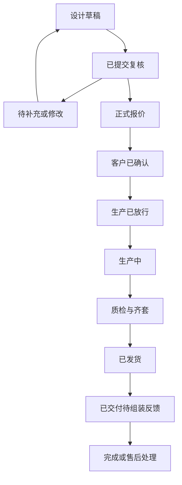

# 定制板式家具平台 PRD v0.1

日期：2026-09-07  
状态：用于验证立项与团队评审的产品需求基线；不是可直接加工的工程图，也不是未经打样即可上线的产品规格。  
配套决策依据：《定制板式家具平台_可行性分析.md》。

## 1. 产品定义与成功条件

**一句话定义：为成品家具尺寸不合适的家庭，提供有限尺寸定制的落地储物柜；用户通过图示和配置选项确认需求，收到加工、封边、钻孔、编号和五金齐套完成的家具套件，按专属教程组装。**

首发只服务工厂所在城市中已核价的配送区域。工厂位置尚未提供，因此不能直接宣布墨尔本或全国上线；测试页只能展示运营已确认的服务邮编。

产品价值假设：让客户以可接受的总价，获得合适尺寸、明确交期、可完成组装且能方便补件的储物家具。

业务形态：早期由一个明确主体向消费者销售套件，使用自有或一家签约工厂履约；允许专业人士推荐订单，但不建设开放交易市场。

### 1.1 必须分别通过的三个门槛

| 门槛 | 证明什么 | 最低要求 |
| --- | --- | --- |
| 需求门槛 | 有客户愿意为范围内产品付费 | 20 个合格正式报价，至少 5 个非亲友客户支付约定意向金，并持续跟踪正式成交 |
| 工程与使用门槛 | 套件能稳定加工、组装和安全使用 | 已批准配置全部关键检查通过；至少 6 套样件和 8 位目标用户组装观察完成；安全问题关闭后方可销售 |
| 经营门槛 | 交付完后仍留下贡献 | 逐单记录实际成本；目标最近 30 单 CM2≥20%，售后准备金足额，不能依靠忽略人工或持续补贴达标 |

数字为本项目拟定的继续投入标准，不是市场基准或安全认证样本量。小样本通过只允许扩大观察，不自动取消审核。

## 2. 首发范围与明确不做的内容

### 2.1 产品结构族

首发产品族：室内干燥环境使用的书房／客厅落地低储物柜。

| 参数 | 试制提案 | 正式可销售条件 |
| --- | --- | --- |
| 总宽 | 600–1,800 mm，用户可输入整数 mm | 仅放行通过规则与工艺验证的范围；1 mm 输入步长不代表 ±1 mm 的制造承诺 |
| 总高 | 450／600／750 mm | 包含顶板、底座／柜脚的最终外高，须通过稳定性及用途验证 |
| 总深 | 350／450 mm | 关闭状态的柜体外包络含门板、背板；拉手突出与门开启包络另行显示 |
| 模块数量 | 1–3 个并列柜体 | 每模块外宽暂设 300–600 mm；总宽、模块数及连接方式必须同时满足规则 |
| 模板 O | 开放格＋层板 | 层板位置与跨度限于批准规则 |
| 模板 D | 柜门＋层板 | 仅一种已批准的门结构、铰链和拉手体系；开启方向可选 |
| 材料 | 一种白色饰面板 SKU；试制按名义 18 mm 方案评估 | 必须登记实际供应商 SKU、批次、厚度、公差、适用环境与材料数据；若改为当地常用的其他厚度，整套相关规则重验 |
| 背板与封边 | 一套固定背板、封边及连接构造 | 由工程验证包给出完整 SKU 与补偿规则，用户不自由选择 |
| 连接件 | 一套批准的可拆装连接体系 | 综合机床可达性、消费者工具、外观、可靠性和成本后确定，不混用未验证替代件 |
| 跨模块顶板 | 可评估整块顶板方案 | 长板须通过加工、支撑、包装与本地运输验证；分段顶板必须在预览中明确显示拼缝 |
| 荷载 | 由模板验证结果发布 | 不预填未经验证的统一 kg 数；没有用途与荷载说明的模板不得上线 |

上述尺寸为试验设计空间。工程负责人可缩小范围；扩大范围、换板厚、换连接方式均触发重新验证，不能由运营在后台直接解锁。

模块外宽之和应与总宽及批准的连接／间隙构造一致。系统不能为了凑整改变客户确认的成品外宽，也不能只检查单个模块忽略整体支撑与稳定性。

### 2.2 不进入首发销售

- 抽屉、反弹开启、自由孔位、自由雕刻、任意五金或无限颜色。
- 悬挂柜、上墙承重柜、高衣柜、床、椅子、坐凳和供人站立的结构。
- 需要贴墙收口、现场裁板、异形斜墙适配的嵌入柜。
- 厨房、洗衣房、浴室、水槽、电器嵌入、承重台面和水电施工。
- 房车、车辆行驶场景、户外、商业重载及儿童专用家具。
- 电视承载用途：只有追加相应用途、荷载和警示验证后才能开放。
- 全国配送、跨厂自动转单、用户直接下载机床程序、开放设计文件商城。

如果客户实际用途属于上述范围，不能靠改商品名称或口头承诺绕过限制。

### 2.3 首发服务与安装边界

套件价格包含的内容必须逐项显示：板件、五金、标签、包装、教程、明确范围内的售后；配送单列并计入付款总价。专业上门量尺、墙体固定与安装服务若提供，独立显示价格和服务主体。

“能自己组装”不自动意味着不需要防倾倒固定。对必须固定的配置，要在购买前说明，并确认可执行的固定方式。未知墙体情况可转人工或专业服务；不能提供一包“万能墙钉”就声称适配全部墙体。

## 3. 用户与角色

| 角色 | 主要任务 | 可做的系统操作 |
| --- | --- | --- |
| 消费者 | 选型、量尺、确认、付款、组装、补件 | 编辑自己的草稿；确认具体版本；查看自身订单和教程 |
| 渠道推荐人 | 帮助客户选型或介绍需求 | 经客户授权访问相关方案；首发可人工记录来源，不默认可替客户签字 |
| 工程负责人 | 产品建库、配置验证、生产审核 | 批准规则与发布包；处理例外；冻结有问题的产品范围 |
| 运营／客服 | 报价、排期、售后协调 | 维护价格和交期数据；不能改已批准工程字段 |
| 工厂负责人／操作员 | 工艺确认、排产、加工、质检 | 访问已分配生产包；记录加工与异常；执行现场放行 |
| 包装／发货人员 | 分拣、齐套、包件与发货 | 扫码核对与阻断漏件；不能绕过生产包版本检查 |

小团队可以一人承担多个角色，但动作和责任仍须留痕。生产执行应由具备相应资格和设备经验的人负责，不属于聊天助手权限。

## 4. 用户完整流程

| 阶段 | 用户看到什么 | 系统／团队做什么 | 离开此阶段的条件 |
| --- | --- | --- | --- |
| 了解产品 | 真实样件、用途、价格区间、工具和安装示例 | 判断服务区与范围 | 用户接受交付形态 |
| 选择模板 | 开放格／柜门款及收纳示例 | 建立产品草稿 | 用途属于支持范围 |
| 输入与量尺 | 成品外尺寸图、可选空间约束图 | 收集尺寸来源与证据，检查明显错误 | 关键尺寸齐全、矛盾已解决 |
| 配置与预览 | 3D、尺寸、内部空间、开启范围和估价 | 运行受控规则；语言修改先生成提议 | 草稿有效，可提交复核 |
| 正式复核 | 缺项追问或确认版图纸、正式总价、交期 | 人工核对，检查供应和产能 | 工程通过，报价可用 |
| 确认与付款 | 确定的设计版本、材料、内容与服务边界 | 保存同意记录与支付状态 | 客户确认，生产前款项结清 |
| 制造与配送 | 订单进度、预约和包件信息 | 工厂适配、加工、QC、齐套 | 无未关闭阻断，支付与包件完整 |
| 组装与支持 | 订单专属步骤、零件查询、人工帮助 | 跟踪教程使用和问题 | 成功组装并完成必要固定，或进入售后 |

V0 使用人工表单、现有 CAD 和人工报价完成相同业务流程。V1 自动化的是已验证流程中的重复操作，不得改变客户确认与生产放行的要求。

## 5. 页面与信息架构

1. **模板列表／详情**：真实产品、支持尺寸、价格范围、用途、工具、组装示例、服务区与适用警示。
2. **量尺向导**：区分成品尺寸与空间尺寸，逐项图示；上传证据，记录不确定项。
3. **配置页**：预览、尺寸、内部空间、选项、约束说明、价格变化；可选自然语言修改。
4. **复核与确认页**：二维尺寸图、版本、正式报价、交付边界、付款状态和确认记录。
5. **订单页**：制造、发货、包件、缺件与售后状态，不要求客户理解 CAM 或 CNC 文件。
6. **组装页**：按步骤显示板件与五金，零件查询、离线下载、人工求助。
7. **管理后台**：审核队列、规则／模板发布、生产包、质检齐套、成本和售后归因。

消费者无需懂 CAD；首发以移动端完成浏览、拍照、确认和组装为主要体验，同时支持桌面配置。

## 6. 功能需求与验收

优先级约定：P0 为 V1 首发闭环必需；P1 在 P0 与实际试点稳定后增加；P2 需要独立收益证据。所有 P0 在 V0 可以先由明确人员与记录人工履行。

### FR-01 服务范围与用途识别 — P0

- 进入配置前收集用途、邮编、大致预算、期望购买时间及是否需要安装。
- 若不支持，明确说明具体限制；可保留询价信息，但不得进入正式付款。
- 用途发生变化时重新校验，例如储物改为电视承载、坐凳或鱼缸支撑。

验收：测试清单中的每个不支持用途均被阻断；运营没有一键跳过工程范围的入口。

### FR-02 尺寸与空间数据 — P0

- 成品尺寸、可用空间尺寸、内部需求尺寸分别存储，不能复用一个含义模糊的 width。
- 前台以 mm 为标准，其他单位输入转换后显示原值和转换值让用户确认。
- 记录尺寸来源：约数、手动复测、专业复测、图片／扫描估计；后两类视觉推断不得自动视为已验证。
- 空间受限时引导测量不同位置，记录踢脚线、障碍、门开启及安装空间。
- 超出规则设定的测量差异或安装余量不足时，必须复测或转人工；不统一套用固定减量。

验收：缺关键尺寸、单位冲突、输入明显量级异常、仅有照片估计、空间尺寸小于成品尺寸，均不能进入工程批准。

### FR-03 配置器与预览 — P0

- 只暴露发布目录中的模板、尺寸与选项；草稿不调用机床执行接口。
- 支持旋转、正视／侧视、尺寸标注、柜门开启、内部可用尺寸和恢复上一步。
- 修改总宽时，按确定规则调整模块或要求重新选择；不得静默改变门数量、材料和连接构造。
- 预览显示拼缝、拉手、支撑与其他会影响客户决策的实际结构。
- 客户提交时保存预览和设计版本；正式确认预览需与批准制造数据核对。

验收：每个批准样例的外尺寸、模块、门向、层板和拼缝与生产发布包一致；渲染失败时仍有尺寸图和表单可用。

### FR-04 AI 辅助修改 — P1

- 自然语言转为允许字段的参数变更提议，展示前后差异、受影响尺寸和价格。
- “中间再宽一点”等有歧义的请求必须追问；不得编造缺失尺寸。
- 修改经过与表单完全相同的约束、价格和版本处理。
- 用户应用之前不写入正式方案；支持撤销。
- AI 不能发布规则、批准生产、改合同条件、承诺未知交期或生成可执行机床程序。

验收：缺 AI 服务时完整购买流程仍可完成；非法字段、绕过规则指令和不支持选项被拒绝或解释，原有效设计保留。

### FR-05 工程规则 — P0

规则至少覆盖：

| 类别 | 必须检查的内容 |
| --- | --- |
| 配置 | 总宽与模块宽一致，尺寸组合在允许域内，材料／五金可用 |
| 几何 | 门与相邻结构的运动包络，内部净空间，孔槽干涉与穿透 |
| 结构 | 层板跨度、支撑、连接数量与位置、整体稳定性、批准用途与荷载 |
| 制造 | 操作面、孔深、刀具可达、最小板件、翻面／侧孔能力、封边补偿 |
| 装配 | 连接关系、步骤依赖、工具可达、预装件、临时支撑与固定步骤 |
| 履约 | 顶板与包件尺寸、重量和承运限制，材料与工厂能力一致 |

规则返回三种结果：`PASS`、`REVIEW_REQUIRED`、`UNSUPPORTED`，并返回规则编号、原因、关联字段和处理建议。

**V0／V1 的 PASS 仅表示自动检查通过，仍须人工工程批准。** 对工程规则本身有缺口的订单不能靠审核人点“通过”绕过；应先修订并验证模板／规则。

验收：每条阻断规则至少有一个触发样例和一个边界合法样例；未知材料、未知工艺能力、缺失荷载规则默认不能批准。

### FR-06 估价、正式报价与库存 — P0

- 配置阶段显示参考估价，明确是否包含税、配送和安装。
- 正式报价绑定设计、BOM、工厂、价目表版本、库存／采购确认和有效期；建议有效期 7 天，运营可在固定政策范围内缩短。
- 售价包含板材损耗、工序、五金、包装、物流、工程服务及合理风险成本。
- 发起付款前重新检查可采购材料、五金与生产档期；有效期不等于无限库存预留。
- 已付款订单缺料时进入异常处理；替代材料、交期或退款方案需客户明确选择。
- 批次排版节省不能以未实现的最优利用率提前承诺；记录估算与实际差异。

验收：过期报价、不同设计版本、变更材料或失效产能均不能沿用旧价格直接进入生产；价格由服务器重新计算，不信任客户端总额。

### FR-07 客户确认与付款 — P0

- 客户确认具体版本的外尺寸、功能、材料、可见结构、总价、交付时间与安装责任。
- 保留确认的文件快照与时间，不只保留一个布尔字段。
- 试点可收有明确退回规则的意向金；它不触发生产，转正式订单时冲抵款项。
- 正式订单建议确认后收 50%，生产前结清余额；支付、退款和订单分别管理。
- 修改已确认设计须生成新版本、重新复核与确认；如价格变化，补退差额在放行前完成。
- 生产后变更作为变更单处理，显示增量成本与影响；消费者保障按适用规则保留。

验收：重复支付通知不重复创建订单或生产任务；未确认、款项不足、存在争议变更的订单均不能生成生产放行令。

### FR-08 不可变生产发布包 — P0

每份发布包至少包含：

- 订单与设计版本；产品、规则、材料、五金和工厂能力版本。
- 批准的外尺寸、模块与板件清单、五金 BOM。
- 每板件成品／开料尺寸、厚度、纹理、A／B 面、封边、局部坐标与孔槽操作。
- 工程检查结果、批准人、时间、关键用途和荷载说明。
- 工程图、标签、包装清单、教程版本及校验值。
- 目标工厂与适配信息；机床特定输出生成后追加其版本和校验关联。

发布包不可覆盖；变更生成新包，旧包标记为停止执行并保留追溯。生产数据和预览不一致时阻断，不能靠修改网页图片掩盖差异。

验收：同一输入与规则版本生成相同语义结果；编译或数据导入失败不得留下可放行的半成品任务。校验值用于追溯，不代表工程正确性证明。

### FR-09 工厂适配与现场执行 — P0

- 首发只连接一个实际打样通过的工厂能力档案和制造软件流程。
- V0 允许工程师人工录入；导出结果必须与确认版核对并记录实际工时。
- V1 仅使用供应商明确支持、符合许可的数据接口或导入；不得将 GUI 自动点击作为无法监测的唯一生产链。
- 跨厂共享板件与操作语义；Nesting、刀具、装夹、操作顺序和后处理在目标工厂生成。
- 现场负责人检查料、刀、机床设置和工艺；系统不会从客户聊天直接启动设备。
- 工厂产能、排期和异常状态回传订单系统。

验收：更换工厂、后处理、关键刀具或连接工艺后，相关样件重新通过；未匹配能力的发布包不能被操作员误领为可执行任务。

### FR-10 质检与齐套包装 — P0

- 每块板件与每类五金有稳定编号；编号关联订单版本，不仅是自由文本 A01。
- 首批订单按工程检验计划检查关键尺寸、孔位、封边、表面与标签；关键特征不得因忙碌跳检。
- 首发前 10 单对所有板件关键项目执行并记录检查；后续非关键项目抽检策略由实际数据批准，安全关键项仍按工程计划执行。
- 包装按步骤与防护需要分箱，实际称重、记录尺寸并核对装箱清单。
- 发货必须核对所有包件、五金袋和必要警示／说明；缺件形成阻断。

验收：故意放入错版本板、重复标签、缺一袋五金、漏一块门板、超承运限制包件时，系统或标准操作流程能阻止发货并留下记录。

### FR-11 安装教程 — P0

- 模板步骤由工程与装配人员批准，再代入该订单的板件、五金、朝向与数量。
- 每步包含所需件、操作、完成检查和必要的安全提示；整套教程标明工具、人数与工作空间要求。
- 支持手机访问、步骤进度、板件反查和离线可下载版本；二维码是入口之一。
- 基础 3D 用于定位；步骤动画为 P1，按真实理解障碍增加。
- 安全相关问题或模型无法判断的装配状态转人工；AI 不建议临时改孔、换螺钉或取消固定。

验收：8 位非专业目标用户观察中至少 7 位完成柜体组装；记录时间、求助、返拆和错误。任何安全步骤遗漏均需修订并重新验证受影响流程。目标中位组装时间暂设 90 分钟以内，不含另行专业固定；未验证前不作为广告承诺。

### FR-12 补件与售后 — P0

- 用订单＋板件／五金编号创建问题，可上传照片，不要求重新解释整套设计。
- 每张售后单记录严重性、症状、原因、成本、解决方案、负责人和关闭证据。
- 补件使用原订单发布数据；如需替代，明确适配与颜色差异，经相关工程／客户确认。
- 缺件、加工或物流问题按责任规则处理，但不得用“定制”一概排除消费者权利。
- 服务目标：1 个工作日内首次人工响应，2 个工作日内明确处理方案或需补充的信息；补件具体交期按产能确认。
- 涉及潜在安全缺陷，先暂停相关模板／批次新生产，追溯受影响订单，按适用要求处理。

验收：能从一张旧订单准确生成单板补件任务；不能使用当前新模板覆盖其原始结构。工单“已回复”与“已解决”分别统计。

### FR-13 成本与经营数据 — P0

- 每单记录报价 BOM 与实际板材、五金、工时、包装、运费、支付、渠道、售后成本。
- 自有工厂用完整一致的成本口径；外包用完整采购价，不重复计制造分项。
- 直营和渠道订单分别统计，渠道费、折扣、样品与引流人工均有归属。
- 成本报表区分产品毛利、CM1、CM2和平台固定成本；准备金与实际索赔不得重复扣同一损失。
- 记录未成交原因与被拒绝配置，不把所有未成交归为“客户没需求”。

验收：抽查任一订单，能从实际记录重算贡献；无法归属的人工或损耗必须显式标记，不能默认为零。

## 7. 状态与变更控制

### 7.1 主订单流程

支付状态独立维护：未支付、意向金、部分支付、已结清、部分退款、已退款、争议中。工程状态独立维护：未检查、需复核、批准、阻断、失效。不得用“订单已支付”替代“工程已批准”。

生产放行必须同时满足：客户确认的设计版本＝报价设计版本＝工程批准版本；材料和产能确认；应收款满足放行条件；标签、包装、教程齐全；没有未关闭阻断。

### 7.2 变更规则

| 变化 | 处理 |
| --- | --- |
| 草稿尺寸改变 | 新草稿修订，重新算规则和估价 |
| 正式报价后改尺寸、材料、用途 | 旧报价失效，工程与客户重新确认 |
| 付款后、开料前改设计 | 冻结放行，形成变更单，处理差额与交期 |
| 已开料后改设计 | 评估已有在制品和新增成本，客户明确选择后生成新任务 |
| 换板厚、连接件、结构模板 | 修改规则版本，重新工程验证；不可在老订单静默替代 |
| 换工厂或关键后处理 | 生成新的适配版本并通过相关现场验证 |
| 运输破损补一块板 | 关联原发布包与售后单，创建单独补件版本 |

退款／取消和安全处置可发生在多个阶段，由对应政策和适用责任决定，不应被简单的单向状态机禁止。

## 8. 核心数据对象

| 对象 | 必须保存的内容 | 约束 |
| --- | --- | --- |
| ProductFamily／Template | 支持用途、参数域、材料、结构、装配、荷载和警示规则 | 经工程批准才可销售；历史版本不可覆盖 |
| MeasurementSet | 测量位置、原始单位、换算值、方法、证据、确认人和可信状态 | 视觉估计与确认尺寸区分 |
| DesignSpec | 成品外尺寸、模块、功能、选项、用途、测量引用、模板版本 | 客户意图的受控表达，不是直接机床指令 |
| Panel／Operation | 板件 ID、成品与开料尺寸、面边、材料、纹理、孔槽和连接引用 | 坐标系、单位和工艺顺序显式 |
| HardwareBOM | 精确 SKU、版本、数量、配套件和安装位置 | 替代品不得只按品牌或名称相似自动匹配 |
| FactoryCapability | 可加工工艺、板材、刀具、封边、翻面、包件与产能 | 版本化；不能仅保存 CNC 品牌 |
| Quote | 成本快照、售价、税费、配送、安装、有效期、工厂与设计版本 | 服务器计算，修改后失效 |
| ProductionRelease | 批准输入、输出清单、校验值、审批和适配引用 | 不可变；重复请求不得重复生产 |
| Package／AssemblyStep | 包件与零件映射、尺寸重量、步骤、工具、姿态和依赖 | 与发布包同版本 |
| QC／ServiceCase | 检验结果、症状、原因、责任、补救与实际成本 | 支持按规则、材料、机床和批次追溯 |

系统内部尺寸可采用整数微米或经过统一舍入政策的定点表示，API 必须标明单位。不得将不同软件的小数舍入差异静默扩散到孔位和封边补偿。

## 9. 技术边界与采购决策

### 9.1 推荐落地组合

- 消费端：常规网页应用＋Three.js 等成熟 3D 显示方案，手机优先。
- 业务端：一套后端、PostgreSQL、文件存储与异步任务队列；初期不拆复杂微服务。
- 工程端：受控 DesignSpec、板件／工艺中间数据与规则；需要实体导出时评估 CadQuery／OCCT。
- 制造端：优先工厂现有、真实验证过的柜体 CAD/CAM；无现成工具时，同样件对比 Mozaik CNC 与 PolyBoard／OptiNest。
- AI：可替换的辅助服务，仅产生允许参数的提议；不作为系统可用性的单点依赖。

在厂商接口实测前，不能承诺无人值守工厂编译。Fusion Automation 是可正式评估的云端备选，而不是因桌面产品印象直接排除。[Autodesk 官方发布](https://aps.autodesk.com/blog/design-automation-api-fusion-now-generally-available)

### 9.2 单一生产依据与适配校验

V0 可由柜体软件生成详细板件，平台保存其批准导出物并核对客户配置；V1 可通过受支持接口自动生成。无论何种方式，**最终批准的板件和五金数据是标签、包装、教程与生产的共同依据**。

如果自建板件层与商业软件并存，必须定义字段映射和差异检查；差异未解释前阻断。不得让前端用一套孔位公式、工厂再用另一套默认规则，却只比较外观截图。

### 9.3 采购试验门槛

用同一份样例需求核查：

1. 许可是否允许商业集成、所需批处理与运行方式。
2. 输入是柜体参数、板件还是仅人工操作；导入是否覆盖所有关键字段。
3. 输出是否包含可审查的板件、五金、封边与孔槽，而非仅封闭机床文件。
4. 工厂机型、刀具和后处理是否通过真实样件。
5. 任务失败、中断恢复、重复请求与升级如何处理。
6. 完整费用包含许可、模块、建库、实施、后处理、培训和维护。

未完成以上事项，允许继续人工服务试点，不允许把未验证自动化写成已交付能力。

## 10. 安装知识模型

模板需要的安装关系至少包括：

- 板件与五金之间的连接端口、方向和配合位置。
- 前置步骤、需要同时扶持的部件、临时稳定条件。
- 工具类型、进入方向、预装连接件与不能遮挡的操作位置。
- 背板、门、拉手、柜脚与必要固定的安装阶段。
- 易错点和完成检查；经供应商确认的紧固方式，不由语言模型自由生成。

教程生成方法：选择批准模板→绑定订单零件→核对五金数量→校验步骤依赖→渲染该订单图片／模型→插入批准说明→人工抽检受影响步骤→绑定发布包。

连接系统改变时，不仅制造规则变化，教程和消费者测试也要重验。Tylko 已公开采用个性化说明及装配顺序包装，因此这些能力应被视为可借鉴的基本产品要求，而非独有壁垒。[Tylko 装配说明](https://tylko.com/en-ot/product-lines/tv-stand)

## 11. 性能、可靠性与数据访问

| 项目 | V1 目标／要求 |
| --- | --- |
| 常规配置反馈 | 尺寸和基础预览目标 p95≤2 秒；服务端完整规则与参考价目标 p95≤5 秒；在试点手机与实际网络下测量 |
| 工程异步任务 | 显示处理中、失败与可重试状态；不因用户刷新重复编译或释放生产 |
| 发布幂等 | 同一生产发布标识重试只生成一个可执行任务 |
| 数据恢复 | 上线前演练从备份恢复订单、发布包、标签与教程；恢复后可重新核对未完成任务 |
| 权限 | 客户仅访问自己订单；工厂仅访问分配任务；支付凭据由支付服务处理 |
| 图片与二维码 | 房间照片受访问控制；公开二维码不包含地址、电话等信息；访问教程不等于获得其他订单资料 |
| AI 数据 | 仅传入完成当前帮助所需信息；关键尺寸和制造规则读取受控对象，不能从历史聊天猜测 |
| 规则发布 | 修改须有作者、批准者、依据、影响范围与验证记录；能暂停模板并定位受影响订单 |

完整 CAD／制造编译可以异步执行，不为追求实时而跳过工程检查。性能目标为验收目标，不是尚未建设系统的实测结果。

## 12. 产品安全与消费者保障要求

适用产品的线上页面、实物永久标签和说明书必须配置所需防倾倒信息。澳洲标准明确包括任何高度的电视承载家具，以及达到指定高度的相关储物类别；具体模板分类按实际用途确定。满足信息标准不等同于产品已通过结构测试。[ACCC 适用分类与要求](https://www.productsafety.gov.au/business/search-mandatory-standards/toppling-furniture-mandatory-standard/toppling-furniture-mandatory-information-standard-supplier-guide)

售后规则区分客户改变主意与产品未达到消费者保障要求，不允许以“定制商品”直接关闭质量问题的退款／更换路径。[ACCC 维修、更换与退款](https://www.accc.gov.au/consumers/problem-with-a-product-or-service-you-bought/repair-replace-refund-cancel)

首发工程验证包必须包含：材料数据、批准用途与荷载、连接与稳定性验证、制造公差及检验方法、工具与安装要求、警示标签／说明书、包装运输验证和异常处理人。缺失任何与当前产品相关的必需项，`catalogue_sellable=false`。

这份 PRD 不指定未经核实的安全 kg 数、允许孔位误差或通用固定件；这些值必须来自选定材料、五金、产品试验和适用要求，并进入可审计规则。

## 13. 验证计划

### 13.1 工程样例集

建立至少 12 个可复算的批准数字样例，包括：最小与最大允许组合、1／2／3 模块、不同门向、开放格、最大层板跨度、顶板拼缝／整板与空间受限情形。

其中选至少 6 套覆盖最不利组合的实物样件；“最不利”由工程人员根据结构、连接与荷载确定，不能简单以最大尺寸代替全部最不利状态。测试类别、荷载和判据在制作前冻结。

### 13.2 软件与链路验收

| 场景 | 期望结果 |
| --- | --- |
| 重复生成同一版本 | 语义板件、五金、封边和教程引用一致 |
| mm／cm 混输 | 明确换算和确认；异常量级不静默接受 |
| 门打开干涉 | 指明对象与解决办法，阻断该方案 |
| 材料厚度或封边改变 | 派生尺寸、孔位和成本重新计算；旧批准失效 |
| 商业软件输出与平台配置不同 | 差异报告，不能继续生产 |
| 修改已付款设计 | 冻结原任务，重新工程与客户确认 |
| 支付通知／编译任务重试 | 无重复订单、无重复放行 |
| 五金缺货 | 不静默替换；交给运营和客户处理 |
| 错版本标签、漏件、超重包件 | 出库阻断 |
| 按旧订单申请单板补件 | 复现旧板件和兼容连接；保留新补件任务身份 |
| AI 不可用或提出不支持选项 | 基础流程可用；无非法参数进入生产 |
| 工厂关键工艺变更 | 需要相关验证，不能默认复用旧批准 |

这是一份待执行验收计划；本次工作没有运行工厂软件、加工样件或完成客户测试。

### 13.3 客户与真实订单试验

顺序：15 位需求访谈与竞品对照→20 个合格正式报价→至少 5 位付费意向客户→8 位非专业组装观察→首 10 单详细工时记录→累计至少 30 单观察交付与贡献。

工程验证与访谈／报价可并行；正式生产不能早于相应产品安全与工艺验证。付费意向可退规则应在收款前清楚说明。

两轮调整价值主张后，20 个合格报价少于 3 个付费意向，暂停该切口；3–4 个属于继续访谈与调整区间，不进入大规模开发；达到 5 个仅允许继续试点。

## 14. 指标、口径与经营决策

| 指标 | 口径 | 初期目标／动作 |
| --- | --- | --- |
| 有效报价转付费意向 | 支付约定意向金的非亲友客户／20 个合格报价 | ≥25% 进入下一轮；不能当作最终成交率 |
| 正式成交率 | 确认且完成约定首付款的订单／正式报价订单 | 单独跟踪，识别意向金后的流失 |
| 首次组装成功率 | 无补件、无现场改孔裁板、无需非计划专业返工而完成的订单／所有达到约定反馈窗口的订单 | 初期目标≥90%；未回复单列并报告覆盖率，不算成功 |
| 安全事件 | 验证、生产、交付和组装发现的安全相关失败 | 任何一例触发受影响配置暂停与原因处理 |
| 完整准时交付率 | 在客户确认日期内全部包件和五金到齐的订单／该期应交付订单 | 目标≥90%；部分发货不算完成 |
| 工程人工 | 售前与工程实际分钟数／订单；未成交售前成本归入渠道成本 | 先测前 10 单，V1 目标中位≤30 分钟，不能删除未计时样本 |
| 售后成本率 | 归属该批订单的补件、退款净损失、物流与相关人工／该批不含税收入 | 基准暂按约 5% 预留；成熟损失高于预留即上调并修复原因 |
| CM2 | 净收入－完整制造成本－履约／工程／客服－风险准备－获客／渠道 | 目标最近 30 单≥20%；归属与风险准备口径一致 |
| 渠道效率 | 分渠道 CAC、贡献、退款、复购与账期 | 推荐渠道更好必须由数据证明 |

客户可在交付后 14 天内提供组装反馈以形成首轮观察窗口；这不是售后权利截止日。经营报告标明订单年龄和未成熟售后，不能用新订单暂无投诉制造低返工率。

## 15. 报价模型与商业限制

与可行性报告一致的基准假设：消费者 A$1,375 含税含本地配送；适用示例口径下净收入 A$1,250；完整制造 A$610，配送 95，支付 25，售前工程 60，安装客服 30，返工准备 60，获客 120；总单笔成本 A$1,000，CM2 为 A$250／20%。

这些数据不是供应商报价。开发报价引擎前，先用实际 BOM、工时与承运报价替换。外包价已包含的分项不能重复加；自营工厂分摊过的固定成本不能再算一遍。

试点定价须满足：覆盖真实完整制造价和可预期履约成本；不靠未来排版优化或复购收入填当前亏损；每次额外定制、专业安装和跨区配送都可解释其价格影响。

C 端高获客成本无法改善时，优先比较专业推荐／批发订单的完整贡献。不要仅因为毛利更低或 CAC 更低就判定某渠道更好。

## 16. 分阶段交付与资源

| 阶段 | 交付物 | 资源假设 | 放行条件 |
| --- | --- | --- | --- |
| V0-A，约 2 周 | 冻结试验品类；工厂能力表；竞品同需求对照；访谈与初版报价表 | 产品负责人＋实际柜体工程／制造负责人 | 可触达客户与可打样路径 |
| V0-B，约 4 周 | 工程验证包、6 套样件、教程、8 人组装观察、报价与意向金实验 | 工厂加工、装配观察、必要的外部测试资源 | 需求与工程门槛通过 |
| V0-C，约 4–8 周 | 人工服务式实际订单；成本、质检、齐套、补件数据 | 运营／客服＋工程与工厂配合 | 不靠未计人工或补贴虚构贡献 |
| V1，前置条件完成后约 8–12 周 | P0 网页、规则、订单、发布包、一个工厂适配、教程与售后后台 | 1 名全栈、1 名具制造软件集成能力人员，以及持续参与的工程与运营；部分角色可兼任 | 所有 P0 验收与真实订单指标达到可接受水平 |
| V1.1，按需求 | AI 参数修改、选定步骤动画、一个高频功能 | 在已有团队能力内逐项增加 | 能证明节省时间或增加有贡献订单 |
| V2，约第 6–12 月条件触发 | 第二工厂对照、第二服务区或一个新品类 | 明确当地订单与供应负责人 | 不同时新增工厂、品类、材料和物流模式 |

周期假设依赖现成可用机床、及时材料、稳定模板与厂商集成支持。仅一位开发者、没有柜体工程负责人或需要重新建产线时，上述时间不适用。AI 辅助开发可以加速实现，不能替代工艺和产品验证。

首轮增量试验预算可先按 A$6,000–12,000 讨论，但须用实际打样、测试、运输与服务报价确认；不含新 CNC、完整团队薪酬和后续平台开发总投入。

## 17. 扩展触发条件

| 新能力 | 何时做 | 何时不做 |
| --- | --- | --- |
| 抽屉 | 存在重复且愿付费的需求，并能冻结一套滑轨与抽屉规则 | 为凑品类而引入多品牌、多结构 |
| 专业量尺／嵌入柜 | 实际订单表明非标溢价足以覆盖上门与安装 | 仅因为扫描模型看起来更完整 |
| RoomPlan／空间视觉 | 对照试验证明降低测量求助／错误总成本，关键尺寸有独立复核 | 把扫描当作加工级测量保证 |
| 自动工程放行 | 某配置域长期稳定、有完整工程证明与异常监控，再逐规则评估 | 仅因 30 单没投诉就取消审核 |
| 自动视觉质检 | 实测漏检、误报、节拍与成本优于当前流程 | 只有视觉 Demo，缺真实缺陷样本 |
| 第二工厂 | 至少 3 组跨厂对照样件通过，适配成本和订单密度可接受 | 首厂模板、标签与补件仍频繁出错 |
| 全国配送 | 已按包件取得实际报价、测试防护并建立损坏处理流程 | 用 flat-pack 一词推定运输便宜 |
| 开放平台 | 两厂以上稳定复制、服务责任明确、平台净收入可覆盖获客与客服 | 只把供应商列表上线就称为平台 |

## 18. 风险与负责人

| 风险 | 早期信号 | 产品／经营动作 | 责任角色 |
| --- | --- | --- | --- |
| 非标低柜溢价不足 | 多数客户选便宜标准家具或其他定制网站 | 调整价值或切口，避免扩大开发掩盖需求失败 | 产品负责人 |
| 量尺错误 | 复测差异、客户分不清外尺寸和净空 | 修改图示、缩小范围、增加专业复核 | 产品＋工程 |
| 装配困难 | 求助、返拆或现场改孔频繁 | 改连接与教程，暂停受影响配置 | 工程＋运营 |
| 生产数据不一致 | 同一订单预览、板件或标签版本不同 | 阻断放行，修复唯一发布依据 | 技术＋工程 |
| 物流侵蚀贡献 | 长板附加费、破损与二次运费 | 限制服务区、调整包装或产品结构 | 运营 |
| 隐性人工失控 | 工程审核和客服时间随销量同比增加 | 只自动化高频重复步骤，缩减例外 | 产品＋运营 |
| 供应不稳定 | 缺料、替代五金、后处理变更 | 停止对应配置，重新确认与验证 | 工厂负责人 |
| 资金不足 | 定金被研发使用、补件无现金 | 订单资金、风险准备与平台投入分开管理 | 经营负责人 |

## 19. 当前缺少的信息及如何处理

| 尚未提供的事实 | 影响 | 本 PRD 的处理 |
| --- | --- | --- |
| 工厂城市、真实配送半径 | 市场与物流 | 上线前仅启用已核价邮编 |
| CNC、控制器、刀具、侧孔和封边能力 | 连接系统与制造软件 | V0 能力检查后才能冻结工程方案 |
| 现有 CAD/CAM 与人员熟练度 | Make vs Buy 与周期 | 优先复用；无工具时做同样件试用 |
| 可采购板材、五金和真实价格 | 板厚、参数域与毛利 | 工程与成本发布前必须取得具体 SKU 和价格 |
| 历史客户、房车订单与现有渠道 | 是否保留房车垂直方向 | 初始低柜作为假设；若已有付费优势则重新比较切口 |
| 团队与预算 | 能否按计划推进 | 采用分阶段门槛，不承诺固定总开发价 |

这些缺口不妨碍访谈、竞品对照和试验准备；它们会阻止未经验证的正式产品发布与大额投入。填入实际数据后应发布 PRD v0.2，并保留这次决策依据。

## 20. 本次立项的具体建议

批准范围建议限定为：**一个城市、一个生产流程、两种柜体结构、一套材料与五金体系的付费验证。**

第一步就同时推进客户报价与实物样件；工程不通过则不销售，需求或完整贡献不成立则不扩张。通过之后，再把已发生的重复劳动开发成 V1。

长期平台化保留在数据与接口设计里，近期经营目标是把一类订单从确认需求交付到成功组装，并清楚知道每单为什么赚钱或亏钱。
